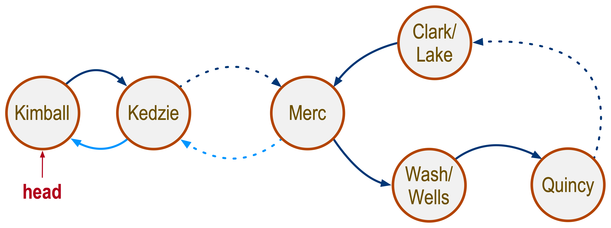

# Lab session of July 1, 2021

For this session we will explore and reinvent doubly linked lists. To make
things interesting, we'll try to connect a singly-linked list that forms a
circle to a doubly-linked list. Then find how to traverse the whole thing. This
is an interesting problems -- in algorithms it involves the study of
_directed cyclical graphs_. Today, we'll focus on a more realistic paradigm:
**Chicago's Brown Line.**

Brown line trains begin and end at the Kimball Station. The train starts at
Kimball, travels south to the Loop area, circles the Loop, and returns to
Kimball. Trains enter the Loop area after the Merchandise Mart (Merc) stop.
After they go around the loop, trains return to the Merc, and travel towards
Kimball, where their run ends.

A simplified map of the Brown Line is shown to the Lab (you may click on the 
image for a larger version). 
The dotted lines 
indicate stations we are omitting for simplicity. The path colors indicate 
direction of travel. The orange path shows the outbound travel. The blue 
path shows the route once the train returns to the Merc station and start 
the inbound trip back to Kimball. Some stations, like Kedzie, are traversed by 
trains 
going in both directions (outbound and inbound). Other stations, like Quincy,
are traversed only by outbound trains.  

Our challenge for today is to derive two classes, one for CTA stations and one
for CTA lines.

## Part 1: conceptualization

_20 minutes, individually_

Timing is important for this step. Use a timer, or an alarm on your watch,
phone, computer, sundial, hourglass, etc, but do time your work. Spend **15
minutes** on reflecting, **5 minutes** on drafting a memo with your thoughts.

Reflect how you will change the design of class Station to meet the requirements
for CTA stations. The basic property here is that some stations have inbound and
outbound trains, while others have only outbound.

Reflect how you can put these new station objects together in a class to
represent a CTA line. How will you connect two stations with both outbound and
inbound trains? How will you connect stations with outbound service only? How
can you connect a station with outbound only to a station with bidirectional
service?

Reflect, think, draw, and finally put your ideas together on a simple note and
email it to leo@cs.luc.edu. Your note can be a piece of paper with drawings and
writing, or a typed up message. It does not have to be too technical, just
conceptual at this level. What I am looking for is evidence that you have
internalized this week's designs, and you can see the differences for the new
requirements today. Demonstrate professionalism and keep your notes neat. A
photo of your drawings with your handwritten thoughts is perfectly acceptable as
is a typed up message. Neatness counts.

## Part 2: rough cut

_20 minutes, in group; random spokesperson to be selected by Leo_

Write a `public class CTAStation` and a `public class CTALine` that **do not**
extend or implement any other classes or interfaces. Your classes must include
all the fields (variables) that you feel necessary. The fields must be `private`
. Include constructors if needed. Do not worry about getters and setters; we can
generate them later and automatically in IDE.

Be prepared and comfortable to discuss the choice of fields and their purpose.

## Part 3: simple implementation

_30 minutes, in group; random spokesperson to be selected by Leo_

Focus on `class CTALine`. Design a method that adds stations to it. Consider
both bidirectional and unidirectional scenarios. Consider how to connect a
unidirectional station to a bidirectional one (for example Clark/Lake back to
Merc).

Reflect how to traverse a CTA line, like the Brown line: beginning at Kimball
and returning to Kimball. What do you have to check at every station? Try 
this on paper first, using the simplified map above. Start from Kimball and 
find your way back to Kimball? How do you do it?

