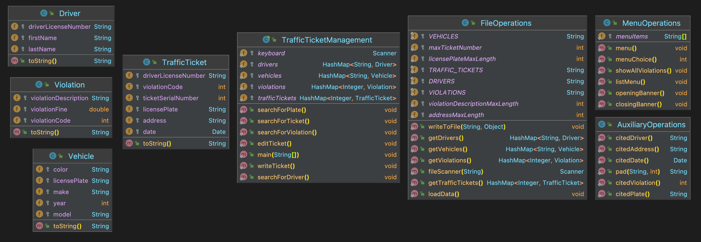

# Traffic tickets



The Traffic Ticket Management System (TTMS) comprises eight classes, as shown above. Four classes are used for `Driver`, `Vehicle`, `Violation`, and `TrafficTicket` objects. The interactions between these classes are orchestrated by class `TrafficTicketManagement`. This class is supported by three more classes that provide auxiliary operations, file operations, and menu operations.

Because of so many cooperating classes, you'll notice that static methods that are outsid  class `TrafficTicketManagement` are called with their class name. For example,
```java
FileOperations.loadData();
```
invokes method `loadData()` that can be found in class `FileOperations.java`.

## Assignment option A: skip the lines

This option is a partial waiver of your final exam. If you work on this option, your final exam will comprise only the *Ungrading Reflection Essay*.

For this option, you must implement the ``searchForPlate()`` method in class `TrafficTicketManagement`.  The method should work very much like the provided `searchForDriver()`. The two methods will have quite a bit of similarity, as you can imagine. However, that similarity can only be recognized once you have internalized how `searchForDriver()` works. To develop this understanding you'll have to spend a bit of time exploring the other classes in the application, running the code, and watching what it does and how.

## Assignment option B: no rush!

This option is just a plain homework assignment.

Write a method ``mostFrequentViolation()`` in ``TrafficTicketManagement`` to look in the HashMap ``trafficTickets`` and return the violation code that is used more frequently than others. You may assume that there is a violation code that appears more often than others.