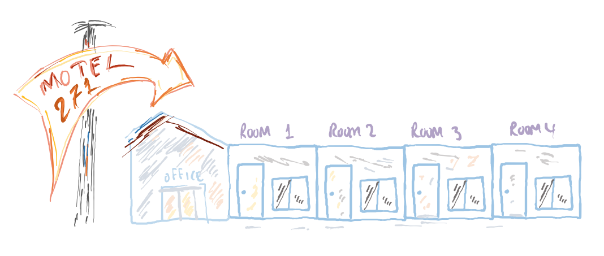

# Coding Studio for August 9, 2022

## Motels and dressers

During our last meeting we designed a simple class for a small motel.
[`Class Motel`](https://github.com/lgreco/DataStructures/blob/master/ClassroomCoding/src/Motel.java) comprises just three variables and four methods, including `main`. 

The three variables are `CAPACITY` which tells how many rooms are in the motel; `guestBook`, an array for the names of the guests, and `COUNT_OCCUPIED`, the number of rooms that are occupied. We expect`0 < COUNT_OCCUPIED <= CAPACITY` at any time.
* Method `arrival` allows a new guest to register at the motel, *if* there are rooms available. Room availability is determined by the condition  `COUNT_OCCUPIED < CAPACITY`  If rooms are available, the guest is admitted: we add the guest's name the motel's `guestBook` and we increment the count of occupied rooms (`COUNT_OCCUPIED`) by 1).
* Method `departure` allows a guest to leave the motel. The checks first that there are guess at the motel (`COUNT_OCCUPIED > 0`). If so, the most recent-to-arrive guest is checked out, the guest's name is removed from the `guestbook`, and the `COUNT_OCCUPIED` is decreased by 1.
* Method `displayGuests` shows a list of all rooms along with the names of the guest staying in each room, or an indication that the room is empty.
* Finally, method `main` provides a brief demonstration of arrivals and departures.

The functionality of `Motel` is limited. If every room is occupied, we cannot admit new guests. This limited functionality mirrors how arrays work in Java. Their size is fixed. If, during the execution of a program, we need to add more items in an array, we cannot.

Like arrays, motels are very rigid constructs. Once we built a motel with only 4 rooms we are stuck with it for a while. Surely we can extend it, if we can afford the time and the expense. 

Let's look at a more flexible scenario: a dresser with 4 drawers that is completely full. We cannot make room by throwing some stuff away, nor is there space for a second dresser. Our only option, as we discussed in class, is to replace the old dresser with a new dresser that has more drawers. The replacement process involves moving the contents of the old drawers to the same drawers in the new dresser.  

The practical questions to consider here are
* when do we know that it is time to get a new dresser?
* how much larger the new dresser should be?
* how to move the contents from the old dresser to the new dresser?
