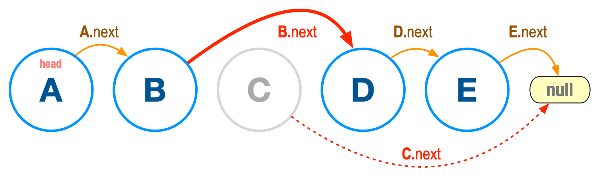

# COMP 271 Midterm Summer 2021

The exam comes in two flavors:

* **Peach flavor:** Problems 1 and 2, or
* **apricot flavor:** Problems 1, 3, 4, and 5.

You only need to complete one of the two flavors.
  
This exam uses the following classes.

* [NFS_Node](NFS_Node.java): a class of nodes with pointers to their previous and next nodes. Think of nodes as a form of the train stations we used in our previous examples. The objects described by class `NFS_Node` have a pointer to their next LLNode and also a pointer to their previous LLNode.

* [DoubleLinkedList](DoubleLinkedList.java): a class that assembles nodes in a bidirectional fashion.

* [Demo](Demo.java): a class that implements a DoubleLinkedList object.


The figure to the right shows a small double-linked list with three nodes: A, B, C. (You may click on the image for a larger rendering). The **head** LLNode is A. In a double-linked list, every LLNode is required to be linked to a previous and a next LLNode. There are two exceptions: the head LLNode has no previous LLNode. The rightmost LLNode has no next LLNode. You can think of the double-linked list as two single lists put together. One list moves from A to B to C. The other from C, to B, to A.

For the problems below, your code must be neat, clean, and thoroughly documented with comments. Neat and clean code means no superfluous or inconsistent spacing, suitably named variables, etc.

## Problem 1 (3 points)

Write a void method `display()` for class `DoubleLinkedList` that traverses the list from head to rightmost LLNode and back to head, printing the contents of each LLNode along the way. For the list of the figure above, the output will be:

`[A] [B] [C] [B] [A]`

Notice that the contents of each LLNode appear inside a pair of square brackets that the program (i.e., you) adds.

## Problem 2 (6 points)

Write a method `removeNode` with the signature shown in the `DoubleLinkedList` class. The method removes a NFS_Node from the list and returns it to the calling part of the program, e.g.

`NFS_Node gone = removeNode("B");
`

finds (if there is one) the LLNode with content "B", removes it from the list, adn returns it as LLNode `gone` for us to inspect it or ignore it. If the list, before the removal, had nodes `[A] [B] [C]`, after the removal has `[A] [C]`. And when traversed with the `display` method from the previous problem, the output will be

`[A] [C] [A]`

Removing a LLNode is a bit complicated, so the following two hints will come handy.

### Hint 1

Before start coding, solve the problem on paper, using circles to represent nodes and arrows to represent points. Come up with a step-by-step description of your technique. For example, do not just state:

`find the LLNode with content "B"`

Instead, describe how:

```{java, tidy=FALSE, eval=FALSE, highlight=FALSE }

begin from the head LLNode and examine every LLNode:
  if LLNode content string we are looking for:
    LLNode found
  else
    no such LLNode exist
```
For every simple step that you identify, look at `class NFS_Node` to find if it provides a method that accomplishes the task. For example, if one of your simple steps is:

`make LLNode with content "B" previous to LLNode with "C"`

the corresponding method is `NFS_Node.setPrevious` and the actual statement would look like:

```java
nodeWithB.setPrevious(nodeWithC);
```
assuming `nodeWithB` and `nodeWithC` are `NFS_Node` objects that have been already assigned values, e.g.,
```java
NFS_Node nodeWithB = new NFS_Node("B");
NFS_Node nodeWithC = new NFS_Node("C");
```

**To summarize this hint:** conceptualize the process using simple design and study class `NFS_Node` very carefully!

### Hint 2

Consider a single-linked list, much like the one we studied in class `Route` and the implementation of the _Lincoln Service_ train line. In general, a single-linked list is a chain of nodes. Each LLNode has a `next` pointer.

<p align="center"></p>

The figure above shows a simple single-linked list. We would like to remove the LLNode with content `"C"`. How can we accomplish this?

First, let's try to show the removal, pictorially:

<p align="center"></p>

That's pretty easy: we take the `next` pointer from the LLNode before `"C"` and we direct it to the LLNode after `"C"`. For a good measure, we also take the `next` pointer from `"C"` and we direct it to `null`. How can we do this in Java? Well, that's something for the final exam; removal from a single-linked list is not as easy as dealing with a double-linked LLNode! But suffice to say this: if we have a way to tell which LLNode is before `"C"`, we can take that LLNode's `next` pointer and move it from `"C"` to `"D"`.

## Problem 3 (1 points)

Write a method

```java
public int countNodes() {...}
```

that returns a non-negative number with the number of nodes in a `DoubleLinkedList` object.

## Problem 4 (3 points)

Write a method 
```java
public String toString() {...}
```
that returns the contents of a `DoubleLinkedList` in reverse order by traversing the list only once from the `head` LLNode to the rightmost LLNode. (Hint: pretend that nodes do not have a `previous` pointer).

## Problem 5 (2 points)

Write a variation of the `add` method in `DoubleLinkedList` with signature

```java
public boolean addUnique(String s)
```

that adds a new LLNode at the right end of the list only if there is no other LLNode already in the list with the same content (`String s`).