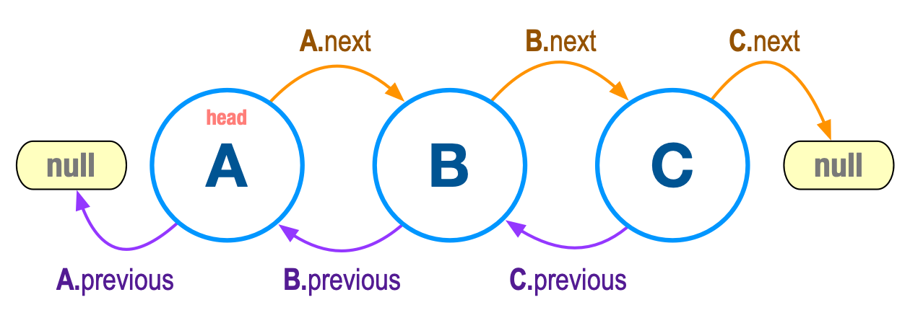

# COMP 271 Midterm Summer 2021

## Problem 1

For this problem use the following classes:

* [Node](Node.java): a class of nodes with pointers to their previous and next nodes. Thinkk of nodes as more generalized concepts of the train stations we used in our examples. The node objects described in `class Node` have a pointer to their next node and also a pointer to their previous node.

* [DoubleLinkedList](DoubleLinkedList.java): a class that assembles together nodes in a bidirectional fashion.

* [Demo](Demo.java): a class that implements a DoubleLinkedList object.

The figure to the right shows 