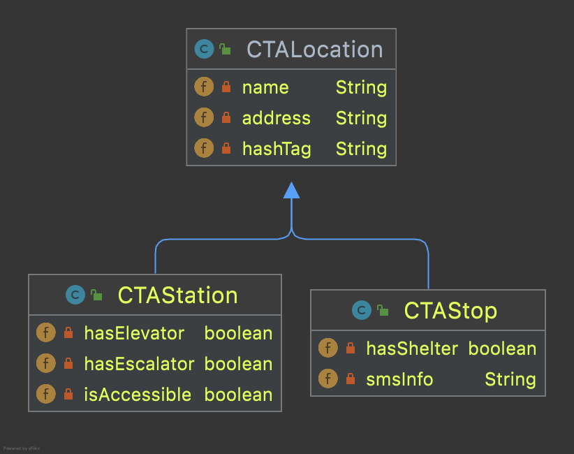

# The CTA

The Chicago Transit Authority is the major mass transit operator for Chicago. Nearly half a billion passengers rely on CTA's trains and buses every year to get around. For all its complexity, the network of buses and trains can be conceptualized as sequences of locations forming routes. These locations are either bus stops or train stations. Some locations serve as both.

The preliminary analysis we did in class showed that both types of locations share some characteristics. For example, they both have a name, an address, and inevitably a hash tag for social media. They also have different fields. For example, a train station may have an elevator; a bus not. Thus we introduced the concept of a *superclass*, a class that has only the common characteristics of stops and stations. These characteristics are *inherited* by other classes that *extend* the superclass. These classes then add their own fields to reflect their individual characteristics. 

Here's the class diagram:

These three classes are in the same directory (folder) as this `readme.md` file and they were generated with the **Diagrams** feature of IntelliJ's full version (which is available at no cost to students everywhere).

## Lab work

In this lab session we'll explore the interplay between a superclass and the classes that extend it (Ch. 9 in BJP).