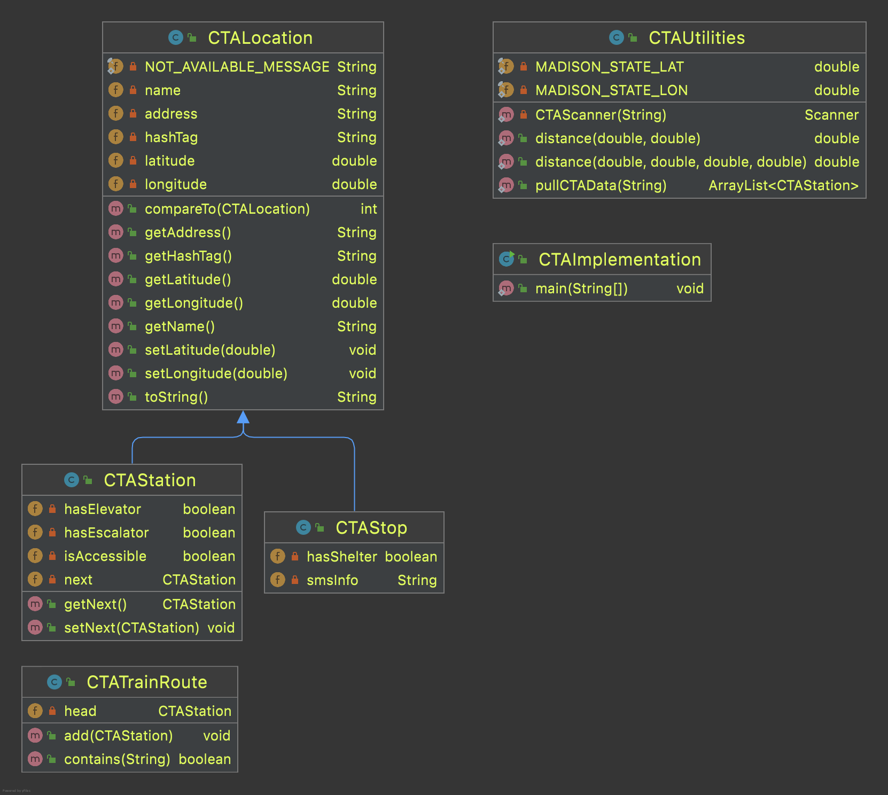

# The CTA

The Chicago Transit Authority is the major mass transit operator for Chicago. Nearly half a billion passengers rely on CTA's trains and buses every year to get around. For all its complexity, the network of buses and trains can be conceptualized as sequences of locations forming routes. These locations are either bus stops or train stations. Some locations serve as both.

The preliminary analysis we did in class showed that both types of locations share some characteristics. For example, they both have a name, an address, and inevitably a hash tag for social media. They also have different fields. For example, a train station may have an elevator; a bus not. Thus we introduced the concept of a [*superclass*, a class that has only the common characteristics of stops and stations. These characteristics are [*inherited*](https://docs.oracle.com/javase/tutorial/java/IandI/subclasses.html) by other classes that *extend* the superclass. These classes then add their own fields to reflect their individual characteristics. 

Here's the class diagram:


These three classes are in the same directory (folder) as this `readme.md` file and they were generated with the **Diagrams** feature of IntelliJ's full version (which is available at no cost to students everywhere).

## Lab planning

In this lab session we'll explore the interplay between a superclass and the classes that extend it (Ch. 9 in BJP).

We'll start with the use of he [super()](https://docs.oracle.com/javase/tutorial/java/IandI/super.html) keyword.

Then we'll move to the obfuscation that Java causes when we privatize -- as we should -- the fields in each class. Thankfully, IDEs like IntelliJ come to the rescue. Try Alt-Ins on your Windows keyboard or Command-N on your Mac for some magical code writing.

### Constructors

Constructors are similar to methods but not quite. The most notable difference is that constructors may be called once per object and their sole purpose is to create one. Methods can be called many times on an object after it has been created.

A constructor creates an object with the fields and the methods specified in a class. The values of the fields may be assigned by the constructor. For example, if we have a simple class like

```java
class Person {
    String firstName;
    String lastName;
    String homeAddress;
}
```

may have a constructor to initiate an object with a name, leaving the addition of a home address for later:

```java
class Person {
    String firstName;
    String lastName;
    String homeAddress;
    ... other fields as needed ...
    
    /** Basic constructor for name only */
    public Person(String firstName, String lastName) {
        this.firstName = firstName;
        this.lastName = lastName;
    }
    
    /** Mutator for home address */
    public void setHomeAddress(String homeAddress) {
        this.homeAddress = homeAddress;
    }
}
```

Using this approach, we can create a new person object with the information we have available, because it's more likely we know the names of a person before we know their address:

```java
Person p1 = new Person("Leo", "Irakliotis");
```
Once we obtain an address, we can modify the object with the set method:

```java
p1.setHomeAddress("123 Main St.");
```

Another characteristic of constructors is that they have the same method as the class whose objects are initiating. 

A class that extends another class inherits its constructor(s). For example, `CTAStop` and `CTAStation` both extend `CTALocation`. They inherit its constructor `CTALocation(String name)` that they can call using the keyword `super()`. So, when class `CTAStation` is told how to create a station with a given name, it can pass the name to its superclass, as follows:

```java
class CTAStation extends CTALocation {
    ...
    public CTAStation(String name) {
        super(name);
    }
}
```

The `super()` keyword calls the constructor of the superclass, i.e., the class identified by the `extends` keyword. That constructor creates a `CTALocation` object whose field `name` aquires the value of `String name`, and returns thst object to the `CTAStation` constructor for further handling.

### Accessors and mutators

First, let's write a few *accessors* and *mutators* methods. Informally, we call them getters and setters because we use the verbs "get" and "set" to name the methods. IDE automation can help us automate the writing of these methods. One technique is to write one getter and one setter for each class field. That's a lot, but it is done automatically. Just tuck these methods away (near the bottom of the class) and let them be.

#### Mutators 
Going back to the example with `class Person`, and assuming it has more than three fieds, we can instantiate an object as

```java
Person p1 = new Person("Leo", "Irakliotis");
```

and then assign its remaining fields as follows

```java
p1.setHomeAddress("123 Main St."); 
p1.setEmail("...");
p1.setBirthday(...);
p1.setPhoneNumber(...)
...
```

That's a lot of writing and there may be ways to reduce it. For example, if we know that by the time we have a home address we may also have an email address and a phone number for a person, we can write an mutator for all three fields:

```java
void setAddressEmailPhone(String homeAddress, 
        String email, 
        String phoneNumber) {
    this.homeAddress = homeAddress;
    this.email = email;
    tis.phoneNumber = phoneNumber;
}
```

Now, we can instantiate a new object person like before,

```java
Person p1 = new Person("Leo", "Irakliotis");
```

and then provide additional information about home address, email, and phone number, using one method instead of three:

```java
p1.setAddressEmailPhone("123 Main St.", 
        "leo@cs.luc.edu", 
        "5555551212");
```

For now, it's ok to be a little verbose and use one set method for each field.

#### Accessors

These are methods that get a value for us. Because the fields of an object are private, we cannot simply make a call to `p1.name` to get the name of the person represented in object `p1`. We need a method to fetch it for us, e.g., `p1.getName()`. The method itself can be as simple as
```java
public String getName() {
    return this.name;
}
```
or something more complex:
```java
public String getName() {
    String result = this.name;
    if (this.name.equals("Voldemort") || this.name.equals("Tom Riddle"))
        result = "He who shall not be named";
    return result;
}
```

We write one accessor for every class field that we need to access from outside the class. These methods can be produced automatically by most IDEs.

## Lab work 23 SEP 2021

* Review an [*actual* data set](https://data.cityofchicago.org/Transportation/CTA-System-Information-List-of-L-Stops/8pix-ypme) about CTA train stations. Make sure you understand what each field in the data set represents. If unsure, be ready to ask for clarifications.
* Propose how to modify class `CTAStation` so that it reflects the actual data set above accurately.
* If your group's proposal is approved, then:
  * add the necessary fields in `CTAStation`;
  * modify the constructor in `CTAStation` to include more fields that you feel confident you can assign at the creation of the object.
* Assume that you have access to a [comma separated values (CSV)](https://en.wikipedia.org/wiki/Comma-separated_values) file with the data from the actual data set. Discuss and propose a strategy to create `CTAStation` objects based on the information from that file. You need only one object per station. Your strategy shall be based on the data structures that we have covered in class so far: arrays, enchanted arrays (ok, ArrayLists), and Trees. You may use one of these data structures (_hint:_ not trees)


## Lab work 30 SEP 2021

* Modify class `CTALocation` as follows:
  * add fields to include latitude and longitude information, justifying your choice for their data type;
  * provide a constructor to include these new fields in addition to the location's name. (Do not replace the basic constructor);
  * include accessors (getters) for every field in the class.
* Use the `main` method in class `CTAImplementation` to obtain a data structure of your choice with all the train stations in the CTA network captured as `CTAStation` objects. 
  * You'll need to employ the methods of class `CTAUtilities`. The data file with the train station information is [available online](https://github.com/lgreco/DataStructures/blob/master/data/stations.csv). Method `CTAUtilities.pullCTAData` can access the CSV file when invoked as\
  `... = pullCTAData("https://raw.githubusercontent.com/lgreco/DataStructures/master/data/stations.csv");`
  * Before using class `CTAUtilities`, you must finish its `pullCTAData` method. Specifically you need to decide, and justify what data structure you'll use.
  * To make things interesting, you cannot add or modify constructors in CTAStation.
  * And, in that vein, you cannot have station duplicates in `CTAImplementation`. Each station must appear only once in the data structure that method `CTAUtilities.pullCTAData` returns.

## Lab work for 07 OCT 2021

This lab session includes the following revisions to the classes of the project. For this session, assume and expect that **all class fields are private** and available only through set and get methods. The revised class diagram is show at the end of this note.

### Code revisions

Class `CTALocation`:

* Added method `compareTo`, in implementation of the `Comparable` interface.
* Added method `toString`.


Class `CTAUtilities`:

* Added method `distance` to compute distance between any two points on Earth, passed to the method as two pairs of longitude and latitude.
* Overloaded method `distance` so that it computes the distance between a single location on Earth passed to the method as a single pair of lat/lot, and the location of Madison and State (the 0/0 point in Chicago).
* Added private, static, final variables with coordinates for State and Madison.

Class `CTAStation`:

* Added new field `private CTAStation next`. This new field  serves as a pointer that allows us to chain `CTAStation` objects together in a linked list.

**New** class `CTATrainRoute`

This class contains only one field, a `CTAStation` named `head`. The class is a conceptual model of a train line. We only need to know where the line begins (its head station). From there we can board a train, that will follow the track to the next station. And the next. And so on. Until we reach the end of the line, and there is no next station from there.

### Lab tasks

* Read the description for today's lab.
* Familiarize yourselves with the code revisions described above (read the comments).
* In class `CTAStation`:
  * Write a method -- with full documentation (comments) -- that tells if an object points to another object. The method signature should be `boolean hasNext()`.
* In class `CTATrainRoute`:
  * Finish the method `add`.
  * Write a method with signature `boolean contains(String name)` to tell if a route contains a station, based on the name of the station.

### Revised class diagram




## Lab work for 14 OCT 2021

Today's last session is based on the class diagram shown above. Here's a quick summary of the tools we have developed so far.

* Object classes `CTALocation`, `CTAStation`, and `CTAStop`.
* A new object class `CTATrainRoute` with the ability to chain `CTAStation` objects together. This class is based on the *linked list* concept of a data structure. When we add train stations to this object, in the order traversed by a train, we end up with a very effective and kind-of-fun representation of an actual train route.
* **CTAUtilities.pullCTAData:** A method that returns an arraylist of `CTAStation` objects for every train station in the CTA network.
* **CTAUtilities.CTAScanner:** A method that returns a scanner for a text file identified by a URL.

## Lab tasks

Your code must be documented properly.

### Populate a train route

Assume you are given a [text file with the names train stations in a specific direction of travel](https://raw.githubusercontent.com/lgreco/DataStructures/master/data/RedLineSouthBound.txt), beginning with the first station. For example:

```text
Howard
Jarvis
Morse
Loyola
Granville
Thorndale
Bryn Mawr
```

Design (and build) a method that will read this file and for every station in it, find (**where?**) the corresponding `CTAStation` object and add it to a `CTATrainRoute` object. Your design will need to address the following questions:

* What is the return type of the method?
* Does the method require any parameters? If yes, what are they?
* Where will the method reside (which class)?

### Reverse a route

All CTA train routes are two-way. For example, the Red Line runs southbound from Howard to 95th/Dan Ryan. And northbound from 95th/Dan Ryan to Howard. Even the Loop lines have two different directions. For example, the Brown line runs from Kimball to the Loop. Somewhere in the loop, the train changes direction. Let's say that the turning point is the Quincy station. Therefore, the southbound Brown line is from Kimball to Quincy and the northbound from Quincy to Kimball.

Once you have a route build in one direction, it's very easy to build a route for the opposite direction. Design a method to do that. The same questions apply here again:

* What is the return type of the method?
* Does the method require any parameters? If yes, what are they?
* Where will the method reside (which class)?

### What to expect next

These are good topics to explore  but are not required for today's lab session.

* Implement a `toString` method for class `CTATrainRoute`.
* Discuss how to fix the `contains` deficiency in the arraylist with all the stations. Since the list includes `CTAStation` objects, we cannot simply invoke a `contains(String stationName)` on it, to find if a station exists or not before adding a new one. For starters, what *is* the deficiency?  (Challenging topic; associative arrays).
* Estimate travel time between stations along a `CTATrainRoute` based on a given average speed for a train (`int averageSpeed`) and the Great Circle distance between the stations.