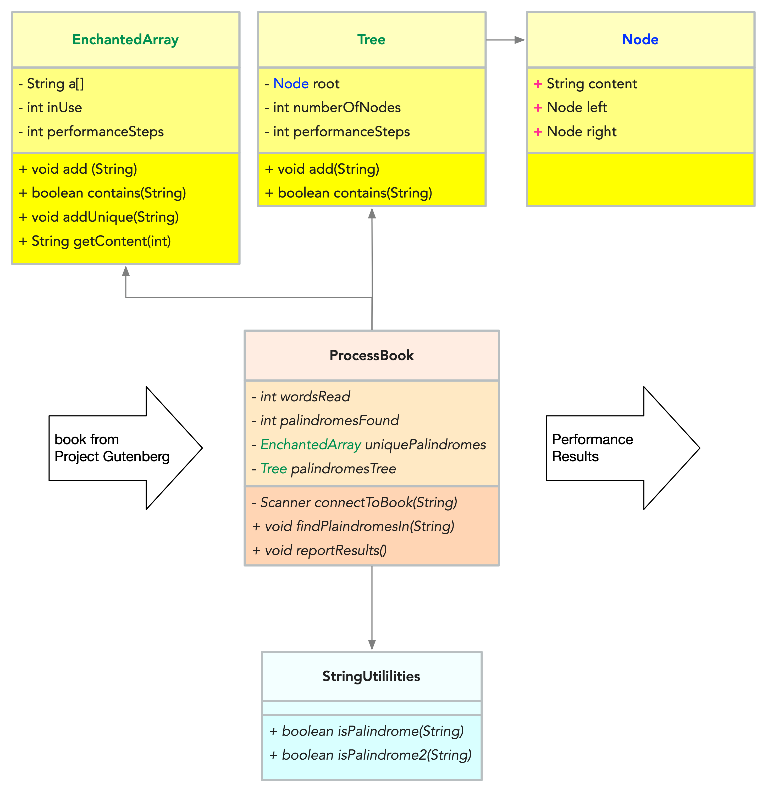

# Lab session of 16 September 2021

Today's lab focus is the **Binary Search Tree** we've been working on. The overall architecture is shown in the figure below. 

Given class `LinkedList271` we'll write methods `add` and `contains` in class `Tree`, ensuring that we are measuring performance (ie steps for insertion), so that we can compare things to the performance of `EnchantedArray`.

