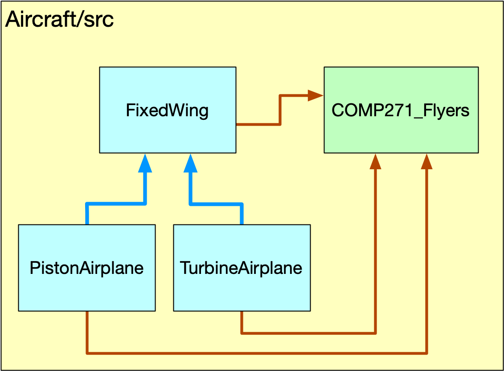

# Lab session of June 17, 2021

The lab work for today involves the files in this directory (`Aircraft/src`). There are four Java classes here:

* `FixedWing.java` is the superclass, i.e., a class that contains the shared characteristics of different kinds of airplanes. For example, they all have a tail number, at least one engine, etc.

* `PistonAirplane.java` is an extension of `FixedWing` specifically for airplanes that are powered by old-fashion engines.

* `TurbineAirplane.java` is an extension of `FixedWing`, specifically for airplanes that are powered by turbine engines.

* `COMP271_Flyers.java` is an implementation class bringing everything together.

As a programmer-*developer* you write classes like `FixedWing`, `TurbineAirplane`, and `PistonAirpane`. As a programmer-*user*, you use such classes to implement your own code to perform tasks in response to some functional and user requirements.



## Part 1

Study the classes mentioned above, in the order listed. Glance over the automagically [*sic*] generated code -- you can always assume that a class will have getter (accessor) and setter (mutator) methods. Focus on programmer code, i.e., stuff that I wrote. (OK, maybe I am overly charitable when calling myself a programmer).

Notice that classes `PistonAirplane` and `TurbineAirplane` **extend** class `FixedWing`. Describe how they extend it, by identifying the different methods or variables between a subclass (such as `TurbineAirpane` or `PistonAirplane`) and the superclass (`FixedWing`). Report these findings at the end of your first group meeting.

## Part 2

Let's focus on the implementation class (`COMP271_Flyers`). Study the array `leoFlightSchool` and the loop in method `main()`. I am using the enhanced for-loo notation to go over an array here. This is similar to code like:

```java
for (int i=0; i<4; i++) {
    String aircraft = leoFlightSchool[i];
    System.out.printf("%s", aircraft.toString());
}
```

I think that the enhanced for-loop works better when dealing with arrays of objects; I prefer the plain style for-loop for arrays of primitives. 

What is the first thing that you notice in the assignment of array elements? What do you think happens?

Why is the printout output different for some aircraft?

Notice the segment of code where we add data for the jet airplane in the fleet (that's the third element of the array `leoFlightSchool`). Why do you think we need to use the code:

```java
TurbineAirplane temporary = (TurbineAirplane) leoFligfhtSchool[2];
temporary.setTurbineType("turbofan");
leoFligfhtSchool[2] = temporary;
```

and not a more direct approach, e.g.,
```java
leoFligfhtSchool[2].setTurbineType("turbofan");
```

Report your findings after your second group meeting.

## Part 3

Method `isGearRetractable()` in class `FixedWing` returns a true or false, boolean value. This may not always be useful. Sometimes we want to express the actual gear system, i.e., "fixed" or "retractable". Write an accessor (getter) method that will do that, i.e., a method that will return a String with the kind of landing gear.

Things to consider: what to call the method? What does the method return? Which class this method belongs to?

## Part 4

Use the method from the previous part to simplify the code for the `toString()` methods in the subclasses of `FixedWing`.